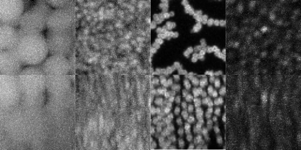
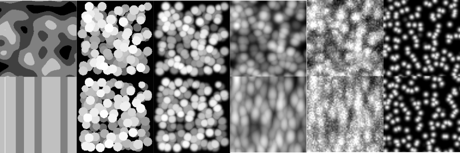

# Colloids: How low can we go?

The Royall Group is interested in using nano-colloidal systems to address the glass transition
which is arguably the greatest outstanding challenge in the basic physics of everyday materials. 
Colloids mimic atoms and molecules and thus exhibit the same behavior, such as forming (colloidal) glasses.
However, since they are micron-sized, they can be imaged with 3d microscopy and their coordinates tracked, 
to test theories of the glass transition (Fig. 1). Smaller colloids enable a more robust test oftheoretical predictions, 
because it is possible to access states where new physics is predicted. To this end, we used new super -resolution “nanoscopy”
to pioneer the imaging of nano-colloids which reveal new insights into the glass transition. However if we can use even smaller particles, we expect to learn much more and for this reason, we wish to develop a machine-learning method for 3d tracking of small nano-colloids.

# Contact 

C. Patrick “Paddy” Royall ESPCI Paris, paddy.royall@epsic.fr

Abdelwahab Kawafi, University of Bristol, a.kawafi@bristol.ac.uk

Giulio Biroli, ENS Paris, giulio.biroli@ipht.fr

# Problem definition

Many applications are used to track spheres in three dimensions, however, the most difficult part of detecting colloids is how densely packed they are (Fig. 1a). Most methods struggle to detect a majority of the particles, and there is a higher incidence of false detections due to spheres that are touching. 
This is defined as the volume fraction ($\phi$) and represents the volume of the particles divided by the total volume of the region of interest.

Moreover, it is impossible to create manually labelled data for this project since there are thousands of colloids per 3d volume, and more importantly manual labelling would be too subjective. Due to this we have created a simulated training dataset.
To reduce photobleaching of the tiny particles during imaging we need to reduce the confocal laser power. 
This results in a high contrast to noise ratio (CNR). 
Where $b_{\mu}$ and $f_{\mu}$ are the background and foreground mean brightnesses, and $b_{\sigma}$ and $f_{\sigma}$ are their standard deviations.

$$
    CNR = \dfrac{b_{\mu} - f_{\mu}}{\sqrt{\dfrac{b_{\sigma} + f_{\sigma}}{2}}}
$$

It also contributes to a high signal to noise ratio which is simply:

$$
    SNR = \dfrac{f_{\mu}}{f_{\sigma}}
$$

The figure below shows some of the steps of the simulation
In addition to the SNR and CNR described this problem has further unique challenges
- Relatively small training sample size (1000)
- Relatively large 3D input size (64 cubed)
- The final prediction will be a larger size than the training samples

# Data Description

The training data for this project consists of an hdf5 file

Fig: Real data and simulated data

The hdf5 file contains all 1000 64x64x64 scans (x’s), labels, true positions of particles, and their diameters. We usually train the model on creating semantic segmentation from the labels but your y will depend on what approach you take. The final output of the approach should be the true positions. (with or without model post processing)

The metadata parameters are as follows:
- volfrac: volume fraction or density of spheres in the volume (usually between 0.1 and 0.5).
- r: radius in pixels in the image.
- particle_size: In micrometers. we use this to define how small the particles would look through the microscope (between 0.1 and 1 micrometers), this determines how bad the point spread function is in the simulation.
- brightness: particle brightness usually between 80-255 (8bit grayscale values).
- SNR: signal to noise ratio.
- CNR: contrast to noise ratio.
- b_sigma and f_sigWma, standard deviations of foreground and background noise (please read on the contrast to noise ratio equation above).

# Metric

For the metric we use average precision (AP), this is similar to ROC and and contains information on precision (fraction of correct detections), recall (how many of all particles are detected), as well as distance of the detections from the truth given by the threshold. Almost all available AP implementations are in 2D and  but we provide a script `metric.py` that will measure this for you in 3D for spheres. Precision is key and is the most crucial factor for good detections, however, the higher the recall the bigger the sample that can be used for downstream analysis.

# Benchmark

For a simple benchmark [TrackPy](https://github.com/soft-matter/trackpy) is a great place to start tracking spheres.