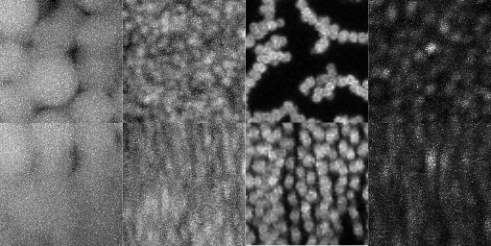
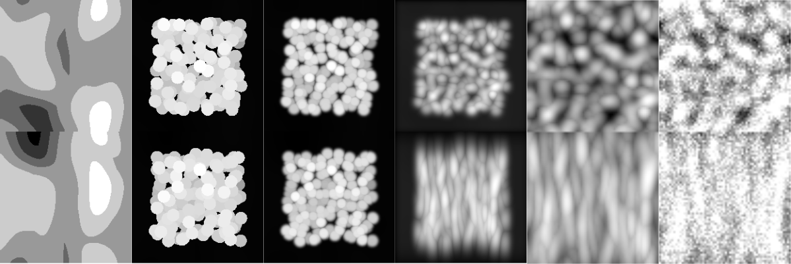

# Problem definition

Many applications are used to track spheres in three dimensions, however, the most difficult part of detecting colloids is how densely packed they are. Most methods struggle to detect a majority of the particles, and there is a higher incidence of false detections due to spheres that are touching.

This is defined as the volume fraction ($\phi$ or volfrac for short) and represents the volume of the particles divided by the total volume of the region of interest. Below you can see an image of various real images of colloids at different volume fractions.



Moreover, it is impossible to create manually labelled data for this project since there are thousands of colloids per 3d volume, and more importantly manual labelling would be too subjective. Due to this we have created a simulated training dataset.
To reduce photobleaching of the tiny particles during imaging we need to reduce the confocal laser power. 
This results in a low contrast to noise ratio (CNR). See [the wikipedia article](https://en.wikipedia.org/wiki/Contrast-to-noise_ratio) for more detail.

Where $b_{\mu}$ and $f_{\mu}$ are the background and foreground mean brightnesses, and $\sigma$ is the standard deviation of gaussian noise.

$$
    CNR = \dfrac{b_{\mu} - f_{\mu}}{\sigma}
$$

It also contributes to a high signal to noise ratio (SNR) which is simply:

$$
    SNR = \dfrac{f_{\mu}}{\sigma}
$$

In addition to the SNR and CNR described this problem has further unique challenges
- Relatively small training sample size (n=1400)
- Relatively large 3D input size (64 cubed)
- The final prediction (x_test) will be a larger size than the training samples (128 cubed)

The figure below shows some of the steps of the simulation



The simulation steps are very simple:
1. Background is drawn
2. Spheres are drawn
3. The image is blurred
4. The point spread function is convolved
5. Noise is added
6. The centers of the particles are shown in the final image

# Metric

For the metric we use average precision (AP), this is similar to ROC and and contains information on precision (fraction of correct detections), recall (how many of all particles are detected), as well as distance of the detections from the truth given by the threshold. Almost all available AP implementations are in 2D and but we provide a script `metric.py` that will measure this for you in 3D for spheres. Precision is key and is the most crucial factor for good detections, however, the higher the recall the bigger the sample that can be used for downstream analysis.

This example shows how to read x, y, and metadata and analyses precision, recall, and average precision

```python
from metric import average_precision, get_precision_recall, plot_pr
from read import read_x, read_y
import pandas as pd

x = read_x(x_path, index)
y = read_y(y_path, index)
metadata = pd.read_csv(m_path, index_col=0)
metadata = metadata.iloc[index].to_dict()

# Find the precision and recall 
prec, rec = get_precision_recall(y, y, diameter=metadata['r']*2, threshold=0.5)
print(prec, rec) # Should be 1,1
# Find precision and recall of half the positions as prediction
prec, rec = get_precision_recall(y, y[:len(y)//2], diameter=metadata['r']*2, threshold=0.5)
print(prec, rec) # Should be 1,~0.5

# Find and plot the average precision
ap, precisions, recalls, thresholds = average_precision(y, y[:len(y)//2], diameter=diameter)
fig = plot_pr(ap, precisions, recalls, thresholds, name='prediction', tag='x-', color='red')
plt.show()
```

